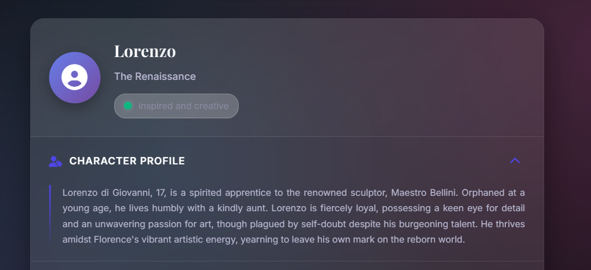

# 🕰️ Echoes of Time

*Step into the shoes of history and experience the past through the eyes of those who lived it.*


## 🌟 Overview

Echoes of Time is a revolutionary **multimodal AI-powered** web application that creates immersive historical experiences. Using Google's Gemini AI, it generates authentic historical diary entries, detailed character profiles, rich historical context, and atmospheric visuals from different time periods. With user authentication, story saving, achievements, and social features, users can build their own collection of historical narratives while exploring the past through personal stories.

## ✨ Key Features

### 🤖 **AI-Powered Historical Storytelling**
- **Authentic Diary Entries**: 150-200 word emotional first-person narratives
- **Rich Character Profiles**: Detailed backstories with names, ages, occupations, and personal circumstances
- **Historical Context**: Fascinating lesser-known facts about daily life in each era
- **Visual Storytelling**: AI-generated atmospheric images depicting historical scenes
- **Multiple Perspectives**: Different characters and viewpoints for each historical period

### 👤 **User Experience & Authentication**
- **User Registration & Login**: Secure account creation and management
- **Personal Profile**: Customizable user preferences and settings
- **Story Collection**: Save and organize your favorite historical experiences
- **Achievement System**: Unlock achievements for exploring different eras
- **Bookmarking**: Mark stories for later reading with personal notes

### 🎭 **Interactive Features**
- **Story Rating & Reviews**: Rate stories and leave comments
- **Social Sharing**: Share compelling historical narratives
- **Story Continuations**: Explore connected narratives within the same era
- **Typewriter Effect**: Immersive reading experience with animated text
- **Responsive Design**: Seamless experience across all devices

## 📸 Screenshots

### Main Interface

*Choose from 8 different historical periods with an elegant, modern interface*

### Story Generation

*Immersive storytelling with character profiles, historical context, and atmospheric visuals*

### User Authentication

*Secure user registration and login system*

### User Profile

*Personal dashboard with saved stories, achievements, and preferences*

### Story Collection

*Browse and manage your collection of historical narratives*

## 🎨 **Design & User Experience**
- **Modern Dark Theme**: Sleek glassmorphism design with particle effects
- **Responsive Grid Layout**: Seamless experience across all devices
- **Smooth Animations**: Enhanced user interactions with CSS transitions
- **Intuitive Navigation**: Easy-to-use interface for all age groups
- **Accessibility**: Designed with accessibility best practices

## 🔧 **Technical Excellence**
- **Real-time AI Generation**: Fast, efficient content creation with Google Gemini
- **Database Integration**: SQLite with SQLAlchemy ORM for data persistence
- **User Session Management**: Flask-Login for secure authentication
- **API Architecture**: RESTful endpoints for frontend-backend communication
- **Error Handling**: Robust error management and user feedback
- **Modular Code Structure**: Clean, maintainable Python and JavaScript architecture

## 🔧 Technology Stack

### **Backend Technologies**
- **Python 3.x** with Flask web framework
- **Google Gemini AI API** for multimodal content generation
- **SQLAlchemy ORM** with SQLite database
- **Flask-Login** for user authentication and session management
- **Flask-Migrate** for database migrations
- **PIL (Pillow)** for image processing
- **Werkzeug** for password hashing and security

### **Frontend Technologies**
- **HTML5** with semantic structure and accessibility features
- **CSS3** with modern features:
  - CSS Grid and Flexbox for responsive layouts
  - Glassmorphism effects with backdrop-filter
  - CSS animations and smooth transitions
  - Custom properties (CSS variables) for theming
  - Media queries for responsive design
- **JavaScript (ES6+)** featuring:
  - Async/await for API communication
  - DOM manipulation and event handling
  - Typewriter effects and animations
  - Local storage for user preferences
  - Modular code architecture

### **Database Schema**
- **Users**: Authentication, preferences, and profile management
- **Stories**: Generated narratives with metadata and ratings
- **Characters**: Detailed character profiles and relationships
- **Bookmarks**: User story collections with personal notes
- **Achievements**: Gamification system for user engagement
- **Ratings & Comments**: Community interaction features

### **Design System**
- **Dark Theme**: Modern glassmorphism UI with particle effects
- **Typography**: Google Fonts integration for readability
- **Color Palette**: Carefully chosen colors for accessibility
- **Responsive Grid**: Mobile-first design approach
- **Micro-interactions**: Smooth animations for enhanced UX

## 🚀 Installation & Setup

### **Prerequisites**
- Python 3.8 or higher
- Google AI API key (free tier available)
- Modern web browser

### **Step-by-Step Installation**

1. **Clone the repository**:
   ```bash
   git clone <repository-url>
   cd echoes-of-time
   ```

2. **Install Python dependencies**:
   ```bash
   pip install -r requirements.txt
   ```
   
   **Key Dependencies:**
   - `Flask 2.3.3` - Web framework
   - `google-generativeai 0.3.2` - AI content generation
   - `Flask-SQLAlchemy` - Database ORM
   - `Flask-Login` - User authentication
   - `Flask-Migrate` - Database migrations
   - `Pillow 10.0.1` - Image processing
   - `Werkzeug` - Security utilities

3. **Set up your Google AI API key**:
   - Get a free API key from [Google AI Studio](https://makersuite.google.com/app/apikey)
   - **Windows**: Edit `run_app.bat` and replace `YOUR_API_KEY_HERE`:
     ```batch
     set GOOGLE_API_KEY=your-actual-api-key-here
     python app.py
     ```
   - **Linux/Mac**: Set environment variable:
     ```bash
     export GOOGLE_API_KEY="your-api-key-here"
     python app.py
     ```

4. **Initialize the database**:
   ```bash
   python app.py
   # Database tables will be created automatically on first run
   ```

5. **Launch the application**:
   - **Windows**: Double-click `run_app.bat` or run it from command line
   - **Linux/Mac**: `python app.py`
   - Open your browser and navigate to `http://localhost:5000`

### **🎯 Quick Start**
1. Register a new account or explore as a guest
2. Choose a historical period from the main interface
3. Click "Hear Their Story" to generate your first narrative
4. Save stories to your collection and unlock achievements!

## 🎯 Usage Guide

### **🔐 Getting Started**
- **Guest Mode**: Explore the app immediately with limited features
- **Create Account**: Register for full access to saving, bookmarks, and achievements
- **User Dashboard**: Access your story collection, profile, and progress

### **📖 Generating Stories**
1. **Choose Your Era**: Select from 8+ historical periods on the main interface
2. **Generate Content**: Click "Hear Their Story" for AI-powered narrative creation
3. **Immersive Experience**: Enjoy typewriter effects and period-appropriate styling
4. **Explore Results**: Each story includes:
   - Authentic diary entry in period language
   - Detailed character background
   - Historical context and setting
   - AI-generated visual representation

### **💾 Managing Your Collection**
- **Save Stories**: Add favorites to your personal library
- **Bookmark System**: Organize stories with custom notes
- **Rating & Reviews**: Rate stories and leave feedback
- **Share Stories**: Export or share your favorite narratives

### **🏆 Achievement System**
- **Story Explorer**: Unlock achievements by discovering different eras
- **Collector**: Build your story library
- **Historian**: Engage with historical content
- **Community Member**: Participate in ratings and reviews

### **⚙️ Customization**
- **Typewriter Speed**: Adjust reading pace preferences
- **Audio Settings**: Control ambient sounds and effects
- **Theme Options**: Personalize your visual experience
- **Profile Management**: Update preferences and view statistics

## 🎭 Available Historical Periods

1. **The Roaring Twenties** - Experience the jazz age through Ruby, a young flapper in Chicago dancing through rebellion and freedom
2. **The Great Depression** - Feel the struggles and hopes of Thomas, a factory worker in Detroit keeping hope alive
3. **The Space Race** - Join Sarah, a NASA engineer in Houston working on humanity's greatest adventure to the stars
4. **The 1960s Counter-culture** - Live the revolution with Peace, a college student in San Francisco believing in love and change
5. **The Dawn of the Internet** - Witness the birth of connectivity with Alex, a programmer in Silicon Valley
6. **World War II Home Front** - Experience the war effort through Betty, a munitions plant worker missing loved ones overseas
7. **The Renaissance** - Create beauty with Lorenzo, an artist's apprentice in Florence surrounded by innovation
8. **The Industrial Revolution** - Feel the transformation with William, a mill worker in Manchester experiencing society's dramatic change

Each period features:
- **Detailed Character Profiles**: Full backstories with personal circumstances
- **Historical Context**: Lesser-known facts about daily life in each era
- **Visual Atmosphere**: AI-generated scenes capturing the mood and setting
- **Authentic Voice**: Period-appropriate language and emotional depth

## 📁 Project Structure

```
echoes-of-time/
├── app.py                 # Enhanced Flask application with multimodal AI
├── requirements.txt       # Python dependencies (updated with new packages)
├── run_app.bat           # Windows batch file for easy startup
├── templates/
│   └── index.html        # Modern HTML template with enhanced UI
├── static/
│   ├── style.css         # Advanced CSS with glassmorphism and animations
│   └── script.js         # Modular JavaScript for enhanced interactions
├── Screenshots/          # Application screenshots
├── README.md             # Comprehensive project documentation
└── LICENSE               # MIT License
```

### **Key Files**
- **`app.py`**: Enhanced backend with character generation, historical context, and image handling
- **`script.js`**: Modular frontend JavaScript with advanced animations and API handling
- **`style.css`**: Modern dark theme with glassmorphism effects and responsive design
- **`run_app.bat`**: Convenient Windows startup script

## 🔌 API Endpoints

### **Core Story Generation**

#### **POST /generate_diary**
Generates a complete historical narrative experience with multimodal AI content.

**Request Body:**
```json
{
  "era": "ancient_egypt"  // Available: ancient_egypt, medieval_europe, renaissance_italy, etc.
}
```

**Enhanced Response Format:**
```json
{
  "diary_entry": "First-person narrative in period-appropriate language...",
  "character_profile": {
    "name": "Character name",
    "age": "Character age", 
    "occupation": "Historical occupation",
    "social_status": "Social position",
    "background": "Detailed character background..."
  },
  "historical_context": {
    "time_period": "Specific historical timeframe",
    "location": "Geographic setting",
    "daily_life": "Description of typical daily activities...",
    "cultural_notes": "Important cultural and social context..."
  },
  "visual_elements": {
    "scene_description": "Detailed description for image generation",
    "image_url": "Generated placeholder image URL",
    "atmosphere": "Mood and setting description"
  },
  "enhanced_metadata": {
    "era": "ancient_egypt",
    "character_type": "scribe",
    "narrative_style": "introspective",
    "historical_accuracy_level": "high",
    "content_themes": ["daily_life", "social_hierarchy", "religious_practices"]
  }
}
```

### **User Authentication & Management**

#### **POST /auth/register**
Register a new user account.

#### **POST /auth/login** 
Authenticate user and create session.

#### **POST /auth/logout**
End user session and logout.

#### **GET /auth/profile**
Retrieve user profile and statistics.

### **Story Management**

#### **POST /api/stories/save**
Save a generated story to user's collection.

#### **GET /api/stories/user**
Retrieve user's saved stories with pagination.

#### **POST /api/stories/rate**
Submit rating and review for a story.

#### **POST /api/bookmarks/add**
Bookmark a story with optional personal notes.

#### **GET /api/achievements/user**
Get user's unlocked achievements and progress.

### **Analytics & Insights**

#### **POST /api/analytics/track**
Track user interactions and story engagement.

#### **GET /api/stats/user**
Retrieve user statistics and reading patterns.

## Contributing

This project is designed to foster empathy and historical understanding. Contributions that enhance the user experience, add new historical periods, or improve the authenticity of generated content are welcome.

## License

This project is licensed under the MIT License - see the LICENSE file for details.

## Acknowledgments

- Built with Google's Gemini AI for authentic storytelling
- Inspired by the belief that understanding history through personal stories creates deeper empathy
- Designed to honor the experiences of those who came before us

---

*"The past is never dead. It's not even past." - William Faulkner*